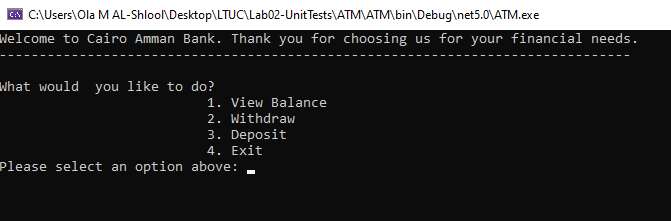
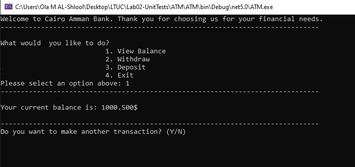
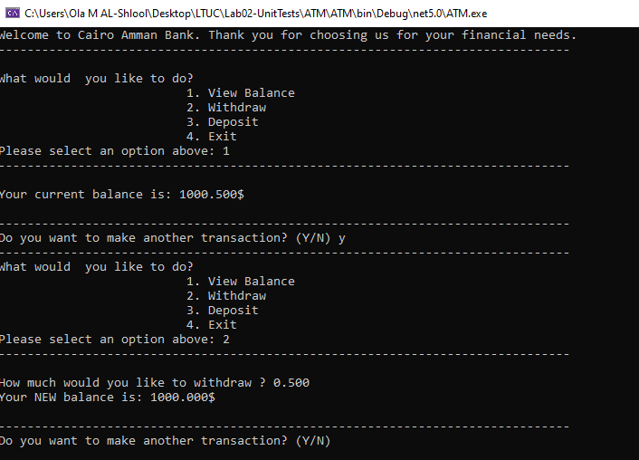
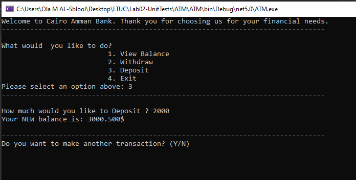
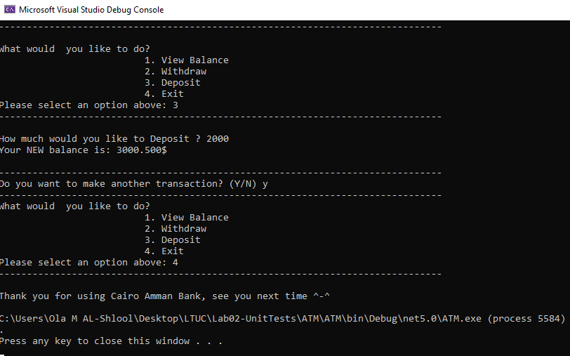
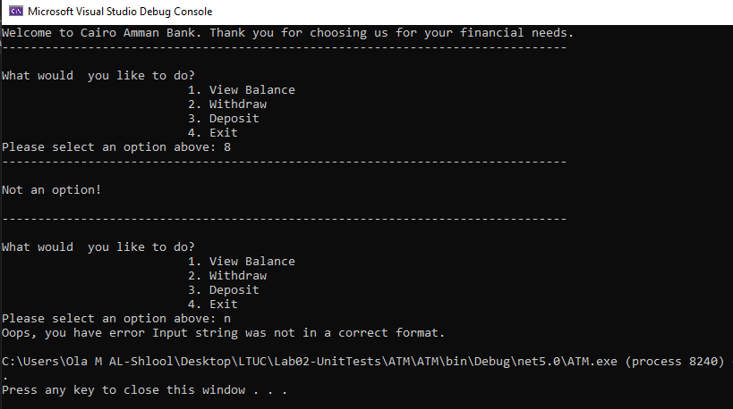
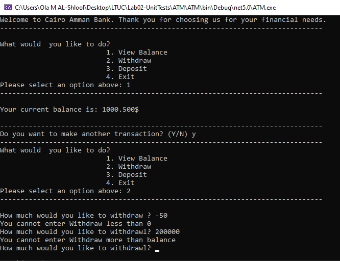

# Lab02-UnitTests

### Problem Domain:
 The console displays options to either display the balance, withdraw money, deposit money, or exit the application.
 There are a few exceptions: You cannot go to a negative balance; 
 and you cannot input anything other than a number.

#### How do you run the program?
1. Clone repo to your device.
2. Open the solution file ATM.sln in Visual Studio.
3. To run the app, go to Debug > Start Without Debugging (or press ctrl+F5).
4. The default starting balance is $1000.500.
5. Select an option by entering a number between 1-4.
6. If Withdrawing or Depositing, an amount will be requested.
7. Enter a number, an error will be thrown if not a number.
8. Continue selecting options until you are content.

#### Home

#### Balance

#### Witgdraw

#### Deposit

#### Exit

#### Error 
##### [1]

##### [2]

